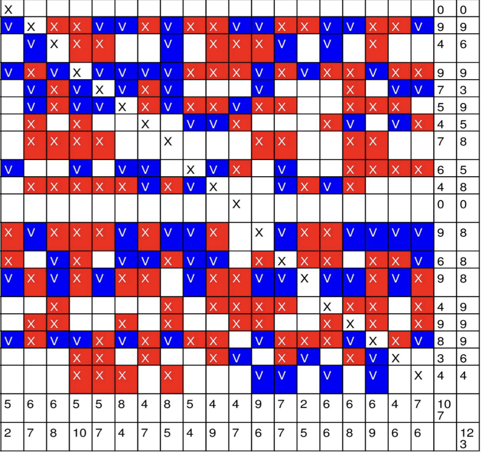
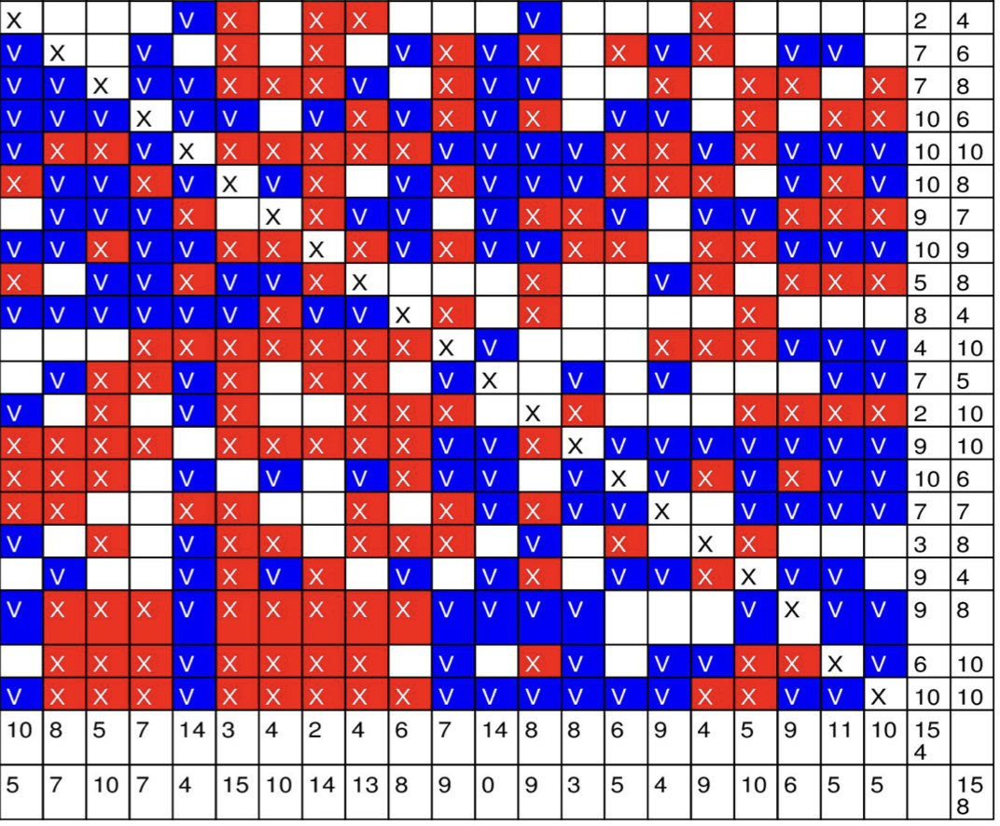
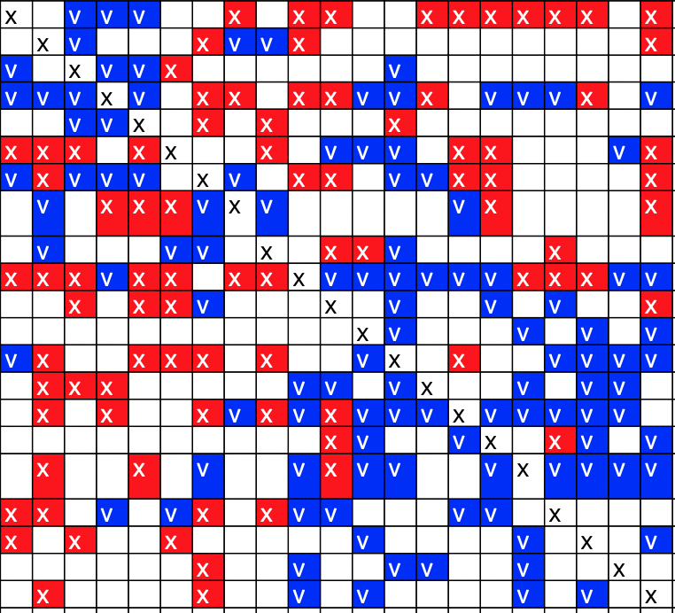

```{r setup, include=FALSE}
knitr::opts_chunk$set(echo = FALSE)
source("hlm2020_nb_script.R")
library(flextable)
```

# Contexte et origine du projet

Ce projet de récolte de données se déroule dans le cadre de l'expérimentation d'un rôle local de personne-ressource en gestion des comportements. Le projet, dans sa première année, concerne les établissements primaires du Haut-Lac et de Monthey et se déroule en 2020-2021.

Le projet est piloté par le Service de l'Enseignement. La HEP-VS y est associée pour documenter le rapport de fonctionnement, via sa coordination en gestion de classe et son équipe de recherche "Emotions, Bien-être et Apprentissages à l'école" (EMA).

# Etat des lieux des contacts avec les classes

En tout, au 24 mai 2021, nous avons reçu officiellement les coordonnées de 8 classes :

- 6 classes dans le cycle 1
- 4 classes dans le cycle 2

Après contact et demande d'autorisation de récolter des données, la situation suivante peut être résumée :

- 4 classes ont accepté de participer
- 1 classe n'a pas rendu réponse
- 5 classes ont refusé

# Résumé de l'échantillon

Le tableau  \@ref(tab:samp) donne une idée des classes qui participent.

```{r samp, tab.id="samp", tab.cap="Résumé de l'échantillon des classes", tab.cap.style="Table Caption"}
fl_w <- 6.3/ncol(sample)
fl <- flextable::flextable(sample)
fl <- flextable::width(fl, width = fl_w)
fl <- flextable::set_header_labels(fl, classe = "Classe", gest = "Type de gestion", deg ="Degré", cyc ="Cycle", sit="Site scolaire", enf="Enfants signalés")
fl <- font(fl, fontname="calibri")
fl

```

# Design et mesures entreprises

D'une manière générale, notre but était de réaliser une prise d'information de la classe avant l'intervention de la personne-ressource puis une autre après l'intervention. La différence avant/après peut être un élément nous renseignant sur l'efficacité de tout le dispositif-pilote.

Les prises d'information concernaient plusieurs domaines d'intérêt. Les voici.

## Au niveau des enseignant·es titulaires

- *Sentiment d'efficacité* dans la gestion de classe (questionnaire en ligne)

   - Je me sens capable (de 0 "pas du tout" à 7 "tout à fait") :

   - d’inclure tous les parents dans la résolution de problèmes de discipline, y compris les moins coopératifs. (sep16_1, implication des parents)

   - d’enseigner le programme de discipline et le bon comportement aux élèves durant l’année scolaire. (sep16_2, gestion proactive) 

   - de créer des stratégies efficaces, à l’avance, pour corriger le comportement d’un élève difficile. (sep16_3, gestion proactive) 

   - de communiquer aux parents mes attentes concernant la discipline de leur enfant en classe dès le début de l’année scolaire. (sep16_4, implication des parents) 

   - d’intervenir aux premiers signes d’indiscipline. (sep16_5, gestion réactive) 

   - de prendre du recul face à une situation difficile dans le but de mettre en place des solutions efficaces à un problème disciplinaire récurent. (sep16_6, gestion proactive) 

   - de mettre en place une collaboration avec des personnes extérieures à la classe (psychologue, médiateur, la direction) pour régler un problème d’inconduite. (sep16_7, implication externe) 

   - de me montrer juste mais ferme lorsqu’un élève ne respecte pas les règles de classe. (sep16_8, gestion réactive) 

   - d’appliquer une punition de manière ferme. (sep16_9, gestion réactive) 

   - de communiquer explicitement avec tous les parents au sujet du comportement bon ou mauvais de leur enfant durant l’année scolaire. (sep16_10, gestion proactive) 

   - de réfléchir et trouver des solutions en coopération avec l’élève difficile. (sep16_11, gestion proactive) 

   - d’appliquer une punition selon le règlement de l’école. (sep16_12, gestion réactive) 

   - d’identifier les élèves fautifs, de leur signaler que leur comportement est inacceptable. (sep16_13, gestion réactive) 

   - de faire appel à des personnes extérieures (psychologue, médiateur, direction) pour m’aider à mieux communiquer avec un élève difficile afin de trouver des solutions. (sep16_14, implication externe) 

   - de dialoguer de manière à ce que ni moi ni l’élève ne sorte perdant à l’issu d’une situation problématique. (sep16_15, gestion proactive) 

   - d’inclure les parents dans la recherche de nouvelles possibilités suite à une situation difficile. (sep16_16, implication externe)


## Au niveau des élèves de la classe

- Sentiment d'amitié via un *sociogramme* (questionnaire en ligne)

   - Avec qui aimerais-tu jouer?

   - Avec qui n’aimerais-tu pas jouer?

   - Avec qui aimerais-tu collaborer?

   - Avec qui n’aimerais-tu pas collaborer?


- Sentiment de *bien-être à l'école* (questionaire en ligne)

   - Ce qui te correspond (1 "pas du tout" à 7 "tout à fait") :

   - J'aime bien être à l'école. (be8_1)

   - Je suis impatient·e d'aller à l'école. (be8_2) 

   - L'école est quelque chose d'intéressant. (be8_3) 

   - *J'aimerais ne pas aller à l'école. (be8_4) 

   - *Il y a beaucoup de choses que je n'aime pas à l'école. (be8_5) 

   - J'adore les activités à l'école. (be8_6) 

   - J'apprends plein de choses à l'école. (be8_7) 

   - *Je ne me sens pas bien à l'école. (be8_8)


- Récolte des *absences* (feuille de suivi en classe)

   - Aucune donnée disponible pour le moment.
   
   
## Au niveau des élèves signalés

- *Compétences psychosociales* (questionnaire papier)

   - (échelle de 1 "jamais" à 5 "le plus souvent")

   - Quand un·e ami·e me donne une information, je vérifie si elle est juste.

   - Quand je lis une information sur Internet, j'essaie de vérifier si elle est vraie.

   - *Je trouve difficile de gérer mon stress.

   - Quand il y a une situation stressante, j'arrive à me calmer par moi-même.

   - Quand je suis en colère, je peux facilement me calmer.

   - Je suis toujours prêt·e à aider les autres (parents, professeurs, jeunes de mon âge).

   - J’arrive à expliquer aux autres ce que je pense.

   - Je communique facilement avec les autres.

   - Quand je ne suis pas d’accord avec un·e ami·e, je lui dis.

   - Quand quelqu'un me demande de faire quelque chose qui ne me semble pas raisonnable ou qui me met mal à l'aise, j'arrive facilement à dire non.

   - J’arrive à comprendre les sentiments de mes ami·es quand ils ou elles sont en colère ou tristes.

   - J’arrive à comprendre pourquoi les gens ressentent ce qu'ils ressentent.

   - Si j’en éprouve le besoin pour mon travail scolaire, je peux demander de l’aide (pendant et/ou en dehors la classe).

   - Quand je décide de faire quelque chose, je vais jusqu'au bout.

   - Quand je prends des décisions, je réfléchis au pour et au contre.

   - J'arrive facilement à gérer les situations imprévues.

   - Je peux résoudre les problèmes que je rencontre si je fais suffisamment d'effort.

   - Je prends le temps de réfléchir avant de faire quelque chose pour résoudre un problème.

   - Pour résoudre un problème, je cherche plusieurs solutions possibles.

   - Quand j’ai des problèmes, je demande de l’aide à mes ami·es.

   - J’arrive facilement à savoir ce que je ressens.

   - J’arrive facilement à trouver les mots pour décrire ce que je ressens.

   - Quand je suis triste, j’arrive ensuite à me remettre de bonne humeur.

   - Les autres viennent facilement se confier à moi.

   - *J’ai du mal à écouter les problèmes des autres.

   - J’aime travailler en groupe.


- *Régulation émotionnelle* (questionnaire papier)

   - (échelle de 1 "pas du tout" à 5 "tout à fait")

   - Quand je suis en colère, je peux facilement me calmer.

   - Lorsque je suis confronté·e à une situation stressante, je fais en sorte d’y penser de manière à ce que cela m’aide à rester calme.

   - Quand je suis triste, il m’est facile de me remettre de bonne humeur.

   - Je retrouve facilement mon calme après avoir vécu un évènement difficile.

   - *Je trouve difficile de gérer mes émotions.


# Données 20-21

## Sociogrammes

Les sociogrammes ont été réalisés dans trois classes. Ils donnent des informations précises sur l'état des relations entre élèves et les zones de risque. Les données détaillées sont en mains des personnes-ressources. Les figures  \@ref(fig:socio) donnent un aperçu d'une des formes facilitant l'interprétation de la qualité des relations dans chaque classe.

A noter : les sociogrammes ne sont pas complétés pour les élèves de 1 à 3H.


```{r socio, fig.show="hold", fig.align='center', fig.height = 2, fig.width = 2.5, fig.cap='Exemples de sociogrammes (extraits anonymisés)'}



```


## Echelle SEP en gestion de classe

Le tableau \@ref(tab:teach) résume les scores à chacune des 4 dimensions de la gestion de classe (gestion proactive, gestion réactive, implication des parents, implication de personnes externes). Chaque score s'entend sur un maximum de 8.

```{r teach, tab.id="teach", tab.cap = "Résumé des données pour les enseignantes", tab.cap.style="caption_nb"}
fl2_w <- 6.3/ncol(teach_sum)
fl2 <- flextable::flextable(teach_sum)
fl2 <- set_header_labels(fl2, clas="Classe", sco_gp="Gest. proactive", sco_gr="Gest. réactive", sco_ip="Impl. des parents", sco_ie="Impl. externe",sco_tot="Total")
fl2 <- colformat_double(fl2, digits = 2)
fl2 <- flextable::width(fl2, width = fl2_w)
fl2 <- font(fl2, fontname="calibri")
fl2
```

## Echelle Bien-être à l'école

Le tableau  \@ref(tab:peers) indique le niveau de bien-être par classe (le score maximal vaut 7).

A noter : l'échelle de bien-être n'est pas complétée pour les élèves de 1 à 3H.

```{r peers, tab.id="peers", tab.cap = "Résumé des scores de bien-être pour les classes", tab.cap.style="caption_nb"}
fl3_w <- 6.3/ncol(peers_sum)
fl3 <- flextable(peers_sum)
fl3 <-set_header_labels(fl3, clas = "Classe", mean = "Moyenne", max = "Score maxium", min = "Score minimum", median = "Médiane", std = "Ecart-type")
fl3 <- colformat_double(fl3, digits = 2)
fl3 <- width(fl3, width = fl3_w)
fl3 <- font(fl3, fontname="calibri")
fl3
```

La représentation graphique  \@ref(fig:vis2) nous donne une idée de la distribution des scores, par classe.

```{r vis2, fig.align='center', fig.width=5, fig.height=5, fig.cap='distribution des scores', echo=FALSE}
be_vis
```

## Echelle de Régulation émotionnelle

*Données en main des personnes-ressources (identification des éventuels besoins)*

## Echelle de compétences psychosociales

*Données en main des personnes-ressources (identification des éventuels besoins)*

## Evolution pré-test / post-test

En séance du 17 mai 2021, les personnes-ressources et le représentant de la HEP-VS ont décidé de renoncer à une récolte post-intervention (voir partie "synthèse"). 

Cette présente année pilote ne contient pas de données avant/après et ne permet pas une comparaison rigoureuse et objective des scores aux différentes dimensions évaluées.

Toutefois, des données qualitatives permettent d'orienter la suite de l'expérience pilote (en vue de l'an 2).

# Données qualitatives

## Représentations graphiques

```{r vis, fig.show = "hold", fig.width=4.5, fig.height=4.5, fig.align = "center", warning=FALSE, results='hide'}
plot_list
```

## Ce que disent les enseignant·es

### Forces

```{r for}
quali_force <- quali %>% 
  select(d)
fl4 <- flextable::flextable(quali_force)
fl4 <- flextable::set_header_labels(fl4, "d" = "Forces")
fl4 <- flextable::delete_part(fl4, part = "header")
fl4 <- flextable::autofit(fl4, add_h = 0.2)
fl4 <- flextable::width(fl4, width = 6.3)
fl4 <- font(fl4, fontname="calibri")
fl4
```

### Limites

```{r wea}


quali_faibl <- quali %>% 
  select(e)
fl5 <- flextable::flextable(quali_faibl)
fl5 <- flextable::set_header_labels(fl5, "e" = "Limites et remédiations")
fl5 <- flextable::delete_part(fl5, part = "header")
fl5 <- flextable::width(fl5, width = 6.3)
fl5 <- font(fl5, fontname="calibri")
fl5


```

### Remarques générales 

```{r rem}
quali_rem <- quali %>% 
  select(f)

fl6 <- flextable::flextable(quali_rem)
fl6 <- flextable::set_header_labels(fl6, "f" = "Améliorations possibles")
fl6 <- flextable::delete_part(fl6, part = "header")
fl6 <- flextable::width(fl6, width = 6.3)
fl6 <- font(fl6, fontname="calibri")
fl6


```


# Synthèse-discussion (avec tableau des opportunités et risques)

## Vers une formalisation renforcée du dispositif

D'une manière générale, si cette année pilote reste comme une expérience positive. Il apparaît assez clairement que le dispositif bénéficiera d'un renforcement de son pilotage et de sa structure. 

L'enjeu est simple : trouver le meilleur compromis entre *flexibité des ERIE* et *maintien d'un projet cohérent* pour chaque enfant. En ce sens, la culture de l'établissement peut jouer un rôle favorable.

## Tableau des opportunités, risques par thèmes

Le tableau \@ref(tab:syn) propose une synthèse sous forme de risques, opportunités et pistes relatives.

```{r syn, tab.id="syn", tab.cap="Résumé des risques, opportunités et pistes", tab.cap.style="Table Caption"}
fl7_w <- 6.3/ncol(syn)
fl7 <- flextable::flextable(syn)
fl7 <- flextable::width(fl7, width = fl7_w)
fl7 <- font(fl7, fontname="calibri")
fl7
```

# Perspectives 21-22

## Recommandations pour les pratiques (processus, objectifs, communication, fonctionnement)

En termes de développement des pratiques, on pourrait s'attendre à une évolution de la mission avec les éléments suivants :

- Le projet de prise en charge est déterminé par des objectifs formulés en collaboration avec les titulaires et bornés dans le temps.
- Le projet est basé sur un protocole par défaut mis en place par la direction (p.ex., semaine 1 : action, semaine 2 : entretien de démarrage (qui a un problème, quel est l'état souhaité,  qu'es-tu prêt à faire ?), semaines 3 à 7 : action et suivi, semaine 8 : fin et décision formelle)
- La direction impose un procotole qui cadre les temps institutionnels de rencontres (calendrier annuel) et limite la durée des mesures (valeur maximale par défaut : 3 mois, reconductible)
- Les lieux pivilégiés de collaboration des ERIE sont les rencontres formelles en interne (DIR, ES, Titulaires)
- L'importance donnée à la clôture des mesures est renforcée
- Dans l'ouverture d'une situation, les titulaires et les ERIE préparent le projet dans une perspective systémique (la classe joue un rôle dans la manifestation du problème de comportement).

## Recommandations pour la recherche autour du projet

Les recommandations suivantes sont nécessaires à la poursuite du projet de rechercher HEP-VS :

- Accord formel entre le SE et la HEP-VS (détermination d'un mandat officiel 21-22)
- Amélioration de la scientificité de la démarche (questionnaires avant/après)
- Amélioration de l'implication des titulaires (participation à la recherche)

Nicolas Bressoud